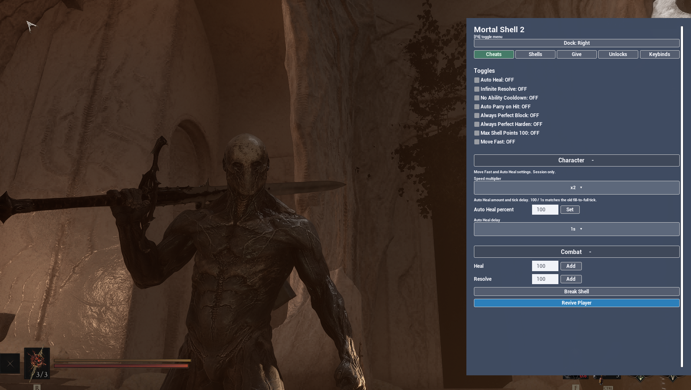

# Mortal Shell II Mod



A [UE4SS](https://github.com/UE4SS-RE/RE-UE4SS) Lua mod for **Mortal Shell II**. In-game cheat menu. Press **F6**.

Five tabs: **Cheats**, **Shells**, **Give**, **Unlocks**, **Keybinds**. Dock left or right. Sections collapse so each tab stays short.

Change any shell anywhere (including Harros after the prologue). Shell and tarstone names come from the game, so they match your language. Unlocks, give any pickup, tarstone levels, currencies, heal / resolve / revive / shell switch (optional hotkeys). God, Auto Heal, Infinite Resolve, no ability cooldowns, Max Shell Points 100, Auto Parry on Hit / Always Perfect Block / Perfect Harden, Move Fast, plus shell-specific Smert Stealth, Genessa Spawn Clone, and Lazlo Detonation.

**Download / install:** [Mortal Shell II Mod on Nexus Mods](https://www.nexusmods.com/mortalshell2/mods/20)

Unlock buttons also fire Steam achievements. Use them only if you are fine with that.

Tested on **UE4SS latest-experimental** (UE 5.6, Steam).

---

## Usage

| Key | Action |
| --- | --- |
| **F6** | Toggle the menu. Tabs along the top: Cheats / Shells / Give / Unlocks / Keybinds. Dock left or right with the Dock button. Click a section header to expand or collapse it. |
| **Heal / Resolve / Damage / Revive / toggle / shell-switch keybinds** | Optional. Set them under the Keybinds tab. They fire while the menu is closed. Heal / Resolve use the amounts from Combat. Damage Player uses Damage to. Saved to `Mods/MortalShell2Mod/config.json`. |
| **Fn+F6** | Laptop / compact keyboard — try this if F6 does nothing. |

---

## Cheats

### Toggles

Saved to `config.json`. Re-applied when you load into a world.

| Control | What it does |
| --- | --- |
| **God** | `CheatManager.God` — pawn cannot be damaged. Re-applied after death / pawn restart while left ON. Saved to config. |
| **Auto Heal** | Heals you (and shell health) when below max. Amount is Character → Auto Heal percent of max HP per tick (default 100%). Delay is Character → Auto Heal delay (default 1s). Persists through death / pawn restart while left ON. |
| **Infinite Resolve** | Refills Resolve when below max. Persists through death / pawn restart while left ON. |
| **No Ability Cooldown** | Player abilities have no cooldown. Persists through death / pawn restart while left ON. |
| **Auto Parry on Hit** | Auto-parries incoming attacks (including red / unparryable) with the Infinite Seal equipped. You do not need to press parry. Saved ON stays checked and retries on load. If you turn it on without the seal, it unchecks and a note appears. |
| **Always Perfect Block** | While blocking with the Untarnished Seal, every hit is a perfect block. Saved ON stays checked and retries every 1s until the live ability exists (not the early default object). A click-on without the ability unchecks. |
| **Always Perfect Harden** | While hardened with Vatra's Seal, every hit is a perfect harden. Saved ON retries on load. Equip the seal first or a click-on unchecks. |
| **Max Shell Points 100** | Sets each shell's point cap to 100. Re-applies after death. Skills you buy still save. Turning it off restores the original caps (bought skills stay). |
| **Move Fast** | Multiplies Walk / Jog / Sprint on CharacterData.Movement. Default x2. Change the Character dropdown while the toggle is on to re-apply. Tops off every 1s if death resets speed. Toggle and multiplier are saved. |

### Character

Speed multiplier for Move Fast. Auto Heal percent and delay for the Auto Heal toggle. Type any percent 1–100 (23 is fine). Invalid input uses 100. Speed and percent are saved to `config.json`. Delay is session only. Off restores speed originals. Re-applies after death / pawn restart.

### Combat

Set the number, then press Add (default 100). Amounts and Damage to are saved.

| Control | What it does |
| --- | --- |
| **Revive Player** | Puts you back in the shell (`S_ReviveShell`). Use after the shell dies and you are fighting unshelled. |
| **Heal** | Heals by the entered amount |
| **Resolve** | Gains Resolve by the entered amount |
| **Damage Player** | `S_DealDamage` on the current bar only: shell HP while worn, flesh when unshelled or in Dark Form. Damage to (saved) is the remaining percent — 35 / 40 / 50 match the low-health tarstone breakpoints. Never deals enough to empty the shell. Want Dark Form? Switch on the Shells tab. Turn Auto Heal off first. Optional keybind. |

---

## Shells

### Switch Shell

Change shell anywhere. Skips the shrine / pickup gate. The list is the game's playable shells (ten, including Solomon) plus Dark Form. Button names use the game's localized display name — they are not hardcoded English titles. The current shell is marked (equipped). Does not learn names — do that in-game if you want the lore.

| Shell | Notes |
| --- | --- |
| Harros | Prologue shell. Restored even after the Tar Golem fight petrifies him. |
| Dark Form | `ActivateDarkForm` (keep anims playing, reinit pose). Success is an out bool. |

### Shell Toggles

Shell-specific. Session only. Equip the matching shell first. Re-apply after death / pawn restart.

| Control | What it does |
| --- | --- |
| **Smert Stealth** | `EnableFightStance` on / `RemovePermanentFightStance` off. Weapons stay out. Smert must be equipped or the toggle unchecks. |
| **Spawn Clone** | Spawns Genessa's left and right astral clones. Genessa must be equipped. Session only. |
| **Lazlo Detonation** | Fires Lazlo's last shockwave on a loop. Lazlo must be equipped or the toggle unchecks. Shockwave delay (0.5s–5s, default 3s) only shows while Lazlo is selected. |

---

## Give

### Tarstones

Names come from the in-game tables (your language). Load into a world first so the lists can fill.

| Control | What it does |
| --- | --- |
| **Category / Tarstone / Add** | Filter by All / Melee / Sidearm / Support, pick one stone, then Add. Adding a stone does not select it under Collected. |
| **Collected** | Stones you already have. Defaults to None. Increment / Decrement Level do nothing until you pick a stone. Status shows that stone's level (1 / 3). Re-equip after a change so effects apply. |
| **Add All Tarstones (Melee / Support / Sidearm)** | Behind a collapsed header. Asks Are you sure? before granting every stone of that type. The button flashes green briefly. |
| **Level All Tarstones** | Behind a collapsed header. Increment All / Decrement All raise or lower every stone you have (UI 1 → 2 → 3). Max is 3. Re-equip after a change so the new effects apply. |

### Give Item

| Control | What it does |
| --- | --- |
| **Item** | Searchable list of pickups. Type to filter, pick one, set Amount (defaults to 1; resets to 1 when you pick a different item), then Add or Remove. Remove asks Are you sure? first. Load into a world first so the pickup table can load. |
| **Give All Items** | Behind a collapsed header at the bottom of Give Item (after Add). Asks Are you sure? then adds every item. |

### Quick Adds

Set the number, then press Add (default 100).

Gold / Gloom / Glimpses / Shell Points / Tarcores / Ventrium / Laterite / Dorsalite / Thoracium / Ovums

Ovums ask Are you sure? first.

---

## Unlocks

Steam achievements unlock with these. Load into a world first. Unlock All, shades, harbingers, Unlock Map, and Reveal All ask Are you sure? first. Cancel or close the menu does nothing. Each unlock flashes green briefly and shows a short Done note. There is no “Unlock Everything” on purpose — that spammed achievement notifications.

### Unlocks

| Control | What it does |
| --- | --- |
| **Unlock All Clothing** | Unlocks clothing |
| **Unlock All Gates** | Unlocks gates |
| **Unlock All Landing Areas** | Unlocks landing areas |
| **Unlock All Masks** | Unlocks masks |
| **Unlock All Seals** | Unlocks seals |
| **Unlock All Shells** | Unlocks shells and world pickups. Does not learn names. |
| **Unlock All Sidearms** | Unlocks sidearms |
| **Unlock All Weapons** | Unlocks weapons |
| **Unlock Shell Shades** | Unlocks shell shades |
| **Unlock Red Harbinger** | Unlocks Red Harbinger |
| **Unlock Cosmic Harbinger** | Unlocks Cosmic Harbinger |
| **Unlock Dark Form Shades** | Unlocks Dark Form shades |

### Map

| Control | What it does |
| --- | --- |
| **Unlock Map** | Asks Are you sure? then fills the map |
| **Unlock Fast Travel** | Unlocks fast travel |
| **Reveal All Icons** | Paints every icon and autosaves — cannot undo |

---

## Keybinds

Saved across launches (`config.json` next to the mod). Fires while the menu is closed. None = off. F6 and mouse buttons cannot be bound. Sections collapse; Toggles starts open, Shells / Switch Shell / Combat start closed.

| Section | What it does |
| --- | --- |
| **Toggles** | One dropdown per Cheats → Toggles checkbox. The key flips that toggle on or off. Seal toggles still uncheck if the seal is not equipped. |
| **Shells** | Smert Stealth / Spawn Clone / Lazlo Detonation. Same as Shells → Shell Toggles. |
| **Switch Shell** | One dropdown per Shells → Switch Shell button (every playable shell + Dark Form). Same as clicking that button. Load into a world first. |
| **Combat** | Heal / Resolve fire the Combat amounts (they are not toggles). Damage Player uses Damage to. Revive Player fires `S_ReviveShell` (same as Cheats → Combat). |

---

## Requirements

| Dependency | Notes |
| --- | --- |
| [UE4SS](https://github.com/UE4SS-RE/RE-UE4SS) | Latest experimental recommended — included in the Nexus full package |
| [ModMenu](https://github.com/mattdavida/ue4ss-ModMenu) | Shared runtime under `ue4ss/Mods/shared/ModMenu/` — included in the download |
| ConfigManager | Shared runtime under `ue4ss/Mods/shared/ConfigManager/` — included in the download |
| Mortal Shell II (Steam) | Load into a world before using the menu |
| `UE4SS_Signatures/StaticConstructObject.lua` | Required on this game — included in the download |

---

## Installation

Install from the [Nexus release](https://www.nexusmods.com/mortalshell2/mods/20) — full package and already-have-UE4SS steps live there.

### Build (contributors)

Edit and test the multi-file `Scripts/` tree. Release is a single `main.lua` (same idea as ModMenu):

```bash
npm run bundle   # dist/MortalShell2Mod.bundle.lua
npm run deploy   # dist/MortalShell2Mod.zip → extract into ue4ss/Mods/
```

```
ue4ss/Mods/
  MortalShell2Mod/
    enabled.txt
    LICENSE
    Scripts/
      main.lua              ← bundled runtime
  shared/
    ModMenu/                ← not bundled; still required
    ConfigManager/          ← not bundled; still required
    UEHelpers/              ← stock UE4SS
```

`Scripts/*.lua` (except `main.lua`) are auto-bundled. `ModMenu`, `ConfigManager`, and `UEHelpers` stay as `require`s.

---

## Notes

- Load into a world first. Buttons do nothing on the title / menu screens (they need a live player controller).
- Unlock buttons fire Steam achievements. Bulk give / unlock / ovum buttons ask Are you sure? first; Cancel does nothing.
- God / Auto Heal / Infinite Resolve / No Ability Cooldown / Auto Parry on Hit / Always Perfect Block / Always Perfect Harden / Max Shell Points 100 / Move Fast re-apply after death / pawn restart (~3 s). Move Fast also tops off every 1s if speed was reset.
- Seal toggles need the matching seal equipped (Infinite / Untarnished / Vatra's). A click-on without the seal unchecks. Saved ON stays checked and retries when you load a world until the live ability exists; a note shows Waiting for ability until then. If you swap seals, turn the toggle off and on again.
- Smert Stealth / Spawn Clone / Lazlo Detonation need that shell equipped. If the ability is not loaded, the checkbox turns itself off.
- Cheats → Toggles, keybinds, speed multiplier, Auto Heal percent, and Combat amounts are saved to `config.json`. Shell toggles (Smert / Genessa / Lazlo) are still session only. Restart the game with a toggle off to leave it off next time.
- Keybinds do not fire while the F6 menu is open. Close the menu, then press the bound key. Heal / Resolve amounts and Damage to always come from Combat.
- After increment / decrement tarstone levels (one stone or all), re-equip the stones or the UI / effects can look stale (especially at level 3).
- Shell and tarstone button / list names are read from the game at runtime so non-English players see the same names as the HUD.
- This game needs the included `StaticConstructObject.lua` signature under `ue4ss\UE4SS_Signatures\` or UE4SS may fail to start.
- This is a cheat / QoL mod — use at your own risk with saves and achievements.
- ModMenu is loaded with `require("ModMenu.ModMenu")` from `shared/`; ConfigManager with `require("ConfigManager.ConfigManager")`. Neither is a separate enabled mod.

---

## Credits

- [RE-UE4SS](https://github.com/UE4SS-RE/RE-UE4SS)
- [ue4ss-ModMenu](https://github.com/mattdavida/ue4ss-ModMenu)

## Links

- Nexus: https://www.nexusmods.com/mortalshell2/mods/20
- ModMenu: https://github.com/mattdavida/ue4ss-ModMenu
